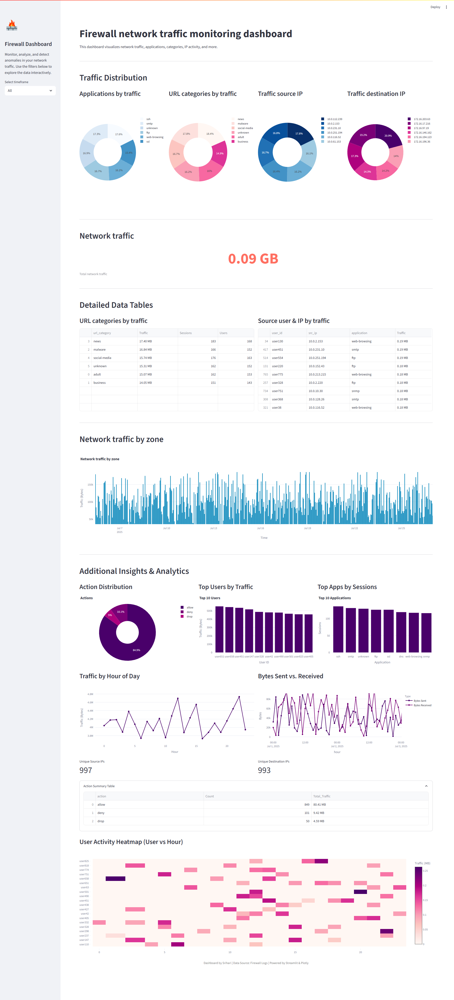

# Firewall Threat & Anomaly Detection – Project Overview

## 1. Why we’re doing this
Firewall is giving millions of log lines every single day. Who has time to read all that?  
So, our idea is to let data science do the difficult work:

* Checking all the logs properly to find the pattern and problem points.  
* Finding any danger or anything strange automatically, almost then and there.  
* Showing everything on one simple screen, so our analysts can just see the main thing.
---

## 2. The data we use
* **Source:** [Internet Firewall Data Set (Kaggle)](https://www.kaggle.com/datasets/tunguz/internet-firewall-data-set)  
* **Where it lives in this repo:** `data/combined_firewall.csv` (plus raw/intermediate files)  
* **Extra features:** `data_synthesis.py` adds things like `total_traffic_bytes` and `hour_of_day`.

| Column | Meaning |
|--------|---------|
| `timestamp` | UTC time of the log entry |
| `src_ip`, `dst_ip` | source / destination address |
| `bytes_sent`, `bytes_received` | traffic volume |
| `application`, `url_category` | higher‑level context |
| `action` | what the firewall did (allow / deny / drop) |

---

## 3. What we found in the data
See **`01_data_eda.ipynb`** for the full walkthrough, but in short:

* A handful of IPs hog most of the bandwidth (right‑skewed traffic).  
* Over 80 % of denied or dropped packets come from fewer than 5 % of source IPs – prime block‑list material.  
* Traffic follows the 8 AM–6 PM workday; spikes outside those hours are suspicious.  
* “Unknown” or “Suspicious” URL categories are denied/dropped more than six times the global rate.

---

## 4. Features we feed the model
First pass, we keep it simple:

1. `bytes_sent`  
2. `bytes_received`  
3. `total_traffic_bytes` (sent + received)  
4. `hour_of_day` (from the timestamp)

Everything is scaled with `StandardScaler` and saved to `scaler.joblib`.

---

## 5. How the model works
Because the logs aren’t labelled, we lean on **unsupervised learning**.

* **Algorithm:** Isolation Forest (via `pyod`)  
* **Assumed threat rate (contamination):** 2 %  
* **Notebook:** **`02_model.ipynb`**

### Quick‑and‑dirty evaluation
We treat `action` ∈ {deny, drop} as “probably bad” and the rest as “probably fine”:

| Metric | Score |
|--------|-------|
| Precision | **0.15** |
| Recall | **1.00** |
| F1 | **0.26** |

High recall means we catch (almost) everything, even if we flag too many false positives for now. Future work will raise precision with richer features.

The trained model lives in `model.joblib`.

---

## 6. The dashboard
File: **`dashboard.py`** (Streamlit)

What you can do with it:

* Filter by time (all time, last hour, 12 h, 24 h)  
* See pie charts for applications, URL categories, source and destination IPs  
* View a bar‑chart time‑series of total traffic  
* Scan tables of top users and categories  
* Compare allow vs deny/drop actions

Run it with:
```bash
streamlit run dashboard.py
```
<!-- DASHBOARD_IMAGE_PLACEHOLDER -->


---
## 7. Reproducing the Results
### 7.1 Environment setup
```bash
python -m venv env
source env/bin/activate      # Windows: env\Scripts\activate
pip install -r requirements.txt
```

### 7.2 Data preparation
Raw Kaggle CSVs → combine/enrich → `combined_firewall.csv`:
```bash
python prepare_enriched_data.py
```
### 7.3 Model training (optional)
```bash
jupyter notebook 02_model.ipynb
```
### 7.4 Run the dashboard
```bash
streamlit run dashboard.py
```

---
## 8. Repository Structure (key files)
```
│  Approach.md            ← (this file)
│  requirements.txt       ← dependencies
│  dashboard.py           ← Streamlit app
│  prepare_enriched_data.py
│  data_synthesis.py
│  model.joblib, scaler.joblib
│  01_data_eda.ipynb
│  02_model.ipynb
└─ data/
   └─ combined_firewall.csv
```
---
© 2025 – Firewall Threat Detection Project 
